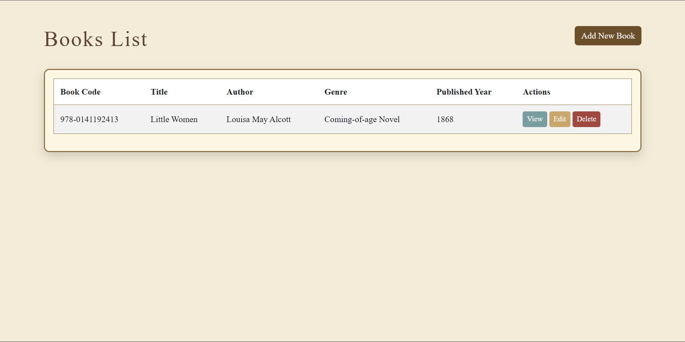
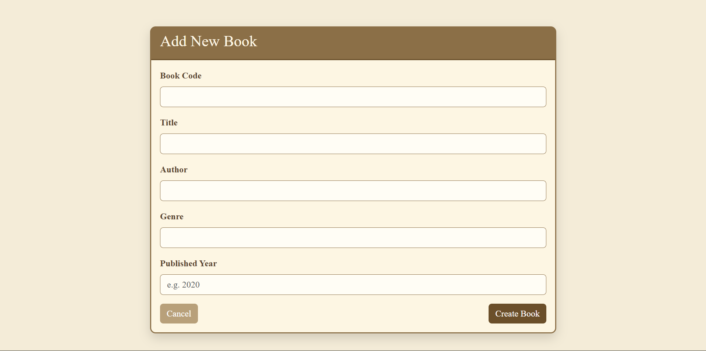
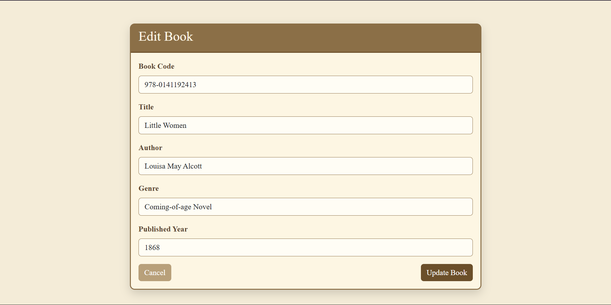
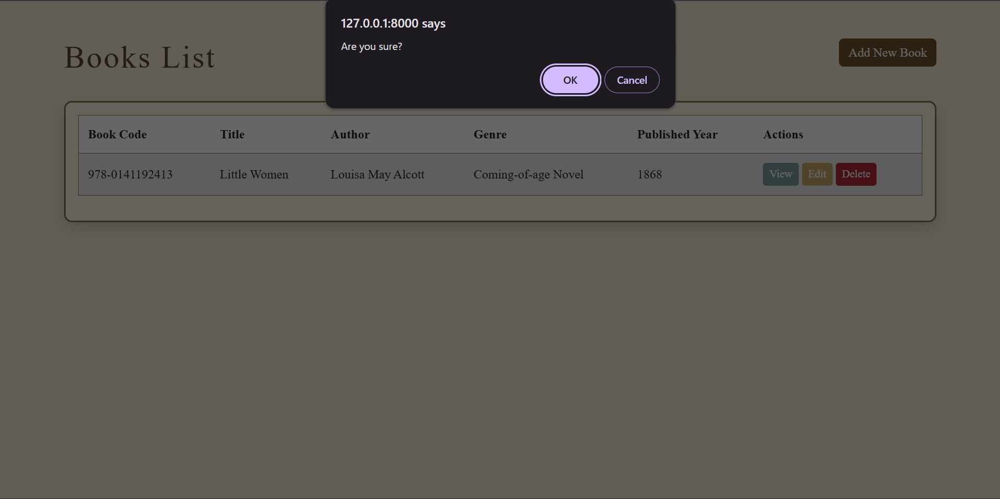

# Book Management System (book-ms)

## Overview

**Book Management System (book-ms)** is a simple CRUD web application built with **Laravel** and **Bootstrap**.
The system allows users to manage a collection of books by performing the following operations:

* Create new book records
* View book details
* Update existing book information
* Delete books from the system

This project demonstrates the implementation of **basic CRUD functionality**, database interaction, and simple UI styling.

---

## Features

* Add new books to the database
* View a list of all books
* View detailed information about a specific book
* Edit book information
* Delete books
* Pagination support for book listings
* Vintage-themed user interface styling

---

## Database Table Fields

The system uses a **books** table with the following fields:

| Field Name     | Type      | Description                         |
| -------------- | --------- | ----------------------------------- |
| id             | bigint    | Primary key                         |
| book_code      | string    | Unique code identifier for the book |
| title          | string    | Title of the book                   |
| author         | string    | Author of the book                  |
| genre          | string    | Genre or category of the book       |
| published_year | integer   | Year the book was published         |
| created_at     | timestamp | Record creation timestamp           |
| updated_at     | timestamp | Last update timestamp               |

---

## CRUD Operations

The system implements the following CRUD operations:

### Create

Users can add a new book by filling out the **Add New Book** form.

### Read

Users can:

* View a list of all books
* View detailed information about a specific book

### Update

Users can modify existing book records through the **Edit Book** page.

### Delete

Users can remove books from the database with a confirmation prompt.

---

## Screenshots

### Books List

### Create Book

### Edit Book

### Delete Book

---

## Technologies Used

* Laravel
* PHP
* MySQL
* Bootstrap 5
* HTML / CSS

---

## Author

Developed as part of a **CRUD application project** demonstrating database operations and Laravel framework fundamentals.
    